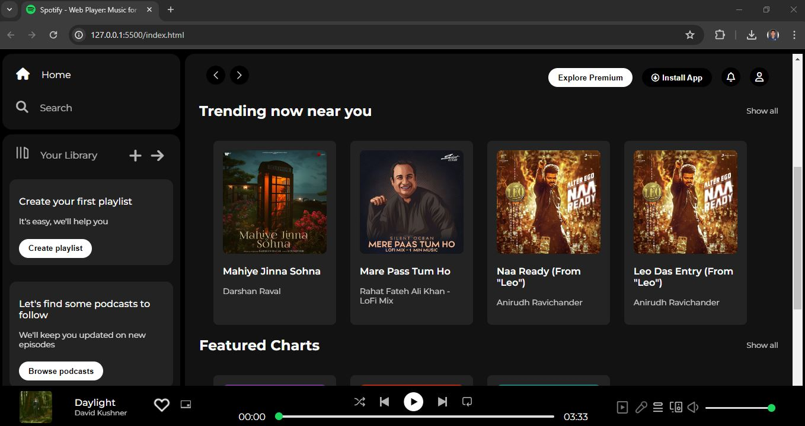
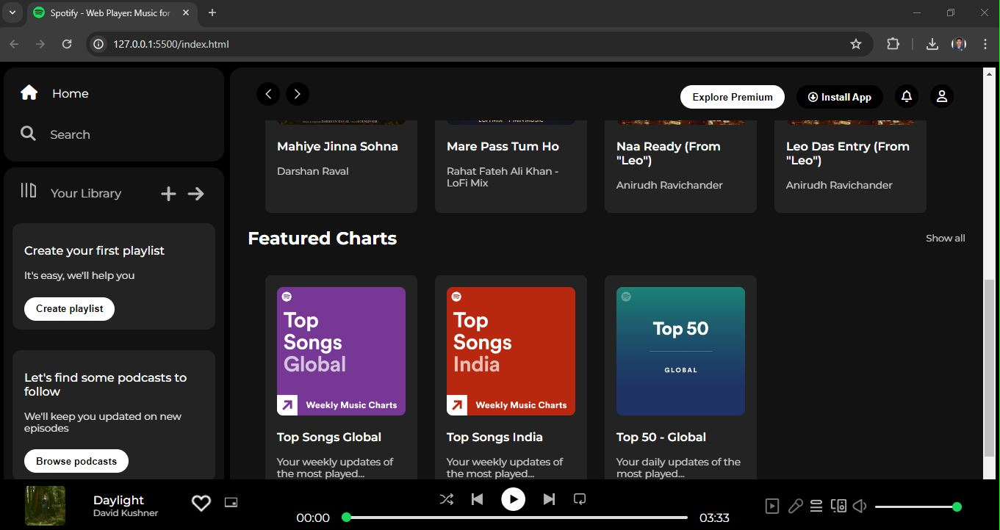

# Spotify Music Player Interface

This project is a dark-themed music player interface designed to mimic the look and feel of popular music streaming services. The interface includes navigation, library management, recently played items, trending music, featured charts, and a fixed music player at the bottom.

## Screenshots:

## Features

- **Dark Theme**: Consistent dark background with white text for a sleek, modern look.
- **Responsive Design**: Layout adjusts for different screen sizes with mobile-friendly elements.
- **Navigation**: Sidebar with options for Home, Search, and Library.
- **Library Management**: Section to manage your playlists and podcasts.
- **Recently Played**: Display of recently played items with hover effects.
- **Trending Music**: Section showing trending music near you.
- **Featured Charts**: Display of top songs globally and in India.
- **Fixed Music Player**: Always accessible music player at the bottom with playback controls.

## Technologies Used

- **HTML5**: Structuring the content.
- **CSS3**: Styling the interface with Flexbox for layout, custom sliders for progress and volume control, and responsive design techniques.
- **Font Awesome**: Icons for navigation and controls.

## File Structure

- `index.html`: Main HTML file containing the structure of the music player interface.
- `styles.css`: CSS file for styling the interface.
- `assets/`: Directory containing images and icons used in the interface.

## Acknowledgements

- Font Awesome for the icons.
- Google Fonts for the Montserrat font.
